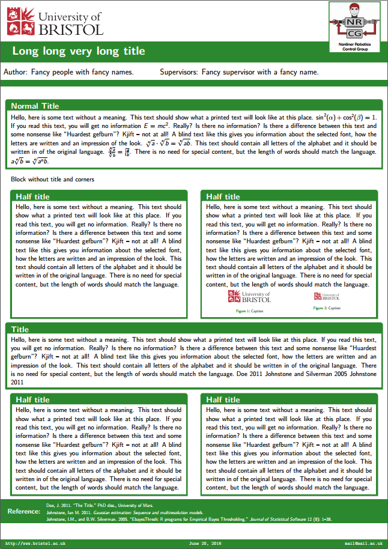

# BeamerPosterThemeUoM

This is a Beamer Theme poster for The University of Manchester.

Inner blocks where designed using **tcolorbox** package and are fully customizable.

References use `biblatex` and chicago referencing style, which can be modified in the style file.

Follow the example available in `poster.tex` to add and remove blocks, fill author details and so on. You can edit `beamerthemeUoMposter.sty` to add or remove logos, change the colour of the blocks or modify anything you want.

### Helpful Tips:

* Use `\begin{UoMblock}[]{title}  \end{UoMblock}` to insert a new content block using the default colour for the template. Follow the different examples in `poster.tex` to customize it's title and borders.
* Using the option `equal height group` in the `\begin{UoMblock}`, you can make two blocks share the same maximum size in case it is needed.
* Sometimes blocks do not resize appropriately in the first compilation. In that case compile twice so everything gets put in order.
* If fine grade resizing is necessary, please change the **scale** value set when including **beamerposter** class.
* Use `\vspace{ }` to add vertical spaces and `\hspace{ }` to add horizontal spaces. Use `ex` as units for vertical spaces and `em` as units for horizontal spaces. 

Follow the license, share with others and be happy.

