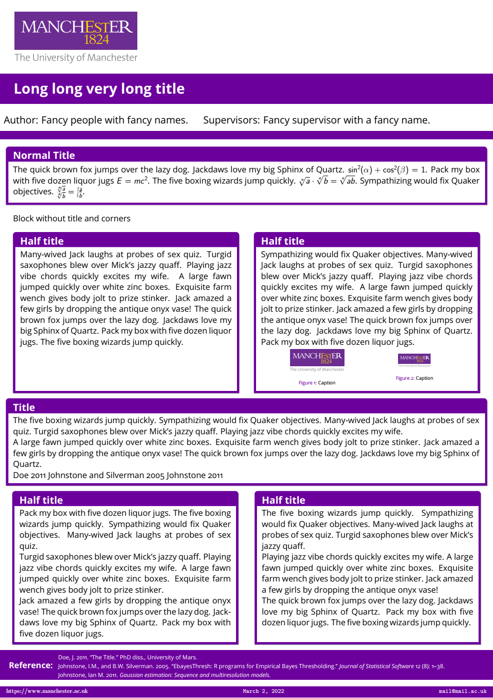

# BeamerPosterThemeNRCG

This is a Beamer Theme poster for University of Bristol's NRCG group.

Inner blocks where designed using **tcolorbox** package and are fully customizable.

References use biblatex and chicago referencing style.

Follow the example available in **poster.tex** to add and remove blocks, fill author details and so on. You can edit **beamerthemeNRCGposter.sty** to add or remove logos, change the color of the blocks or modify anything you want.

Follow the license, share with others and be happy.

  

